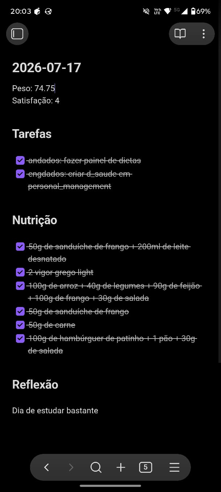

# Docs

Aqui você encontra o planejamento por trás dessa 
infraestrutura, diagramas e muito mais.

Antes, de começar, eu tentei enteder as necessidades "do negócio":
[Que você pode ver aqui - visualizações](./views.md),

Depois, projetei um modelo de nota diária no Obsidian para 
coleta dos dados.

A arquitetura, você pode ver aqui:

[Nossa arquitetura](./architecture.md)

Por fim, modelei e fiz o painel que você encontra documentado aqui:

[Visualizações](./views.md),
