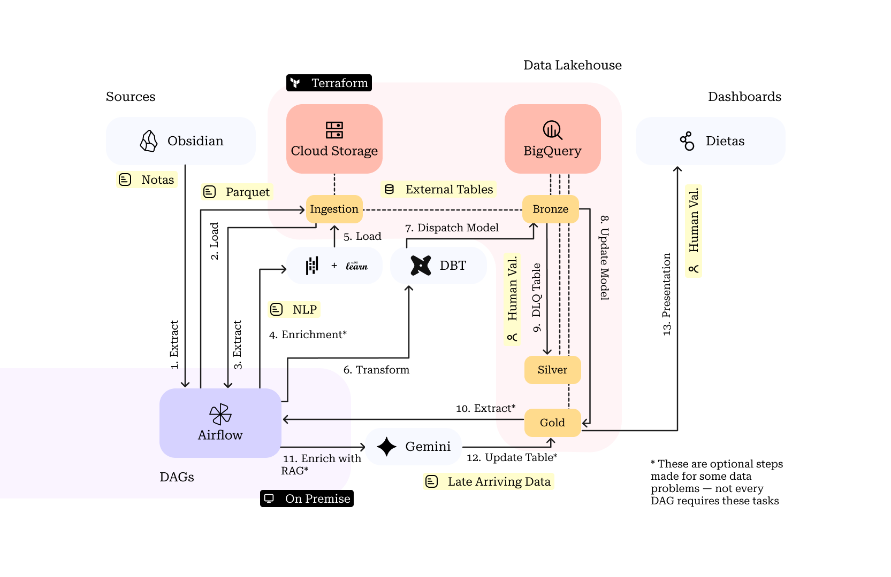

# Arquitetura

A atual arquitetura consiste em um Data Lakehouse com: On Premise + GCS + BigQuery.

Com essa arquitetura, conseguimos usar o 'External Tables' do GCP para fazer 
consultas direto nos arquivos - desacoplando ingestão de transformação. 

Um ciclo típido do dado seria:
0. [Obsidian] Capturar dado em notas
1. [Airflow] Disparar tarefa de ingestão de arquivo
2. [Airflow] Armazenar arquivo no GCS em formato Parquet
3. [Airflow] Ler arquivo e enriquecê-lo com predição e NLP
4. [Airflow] Armazenar arquivo enriquecido no GCS
4. [Terraform] Configurar conexão de GCS com camada Bronze no BigQuery
5. [Airflow] Disparar tarefas DBT para transformar dado no warehouse
6. [DBT] Carregar dado bronze no dataset gold no BigQuery
7. [DBT] Carregar dados corrompidos para tabela DLQ em silver 
8. [Airflow] Disparar tarefa RAG para suplementar tabela gold com LAR
9. [Humano] Verificar dados e corrigir
10. [BI] Consumir modelagem warehouse para visualização
