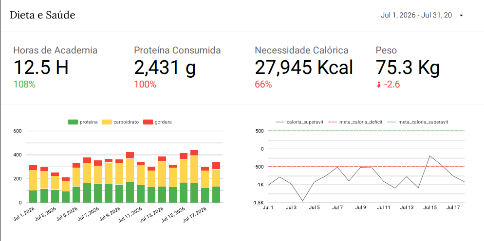
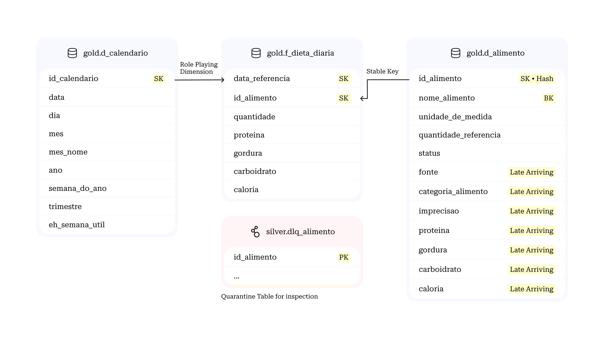
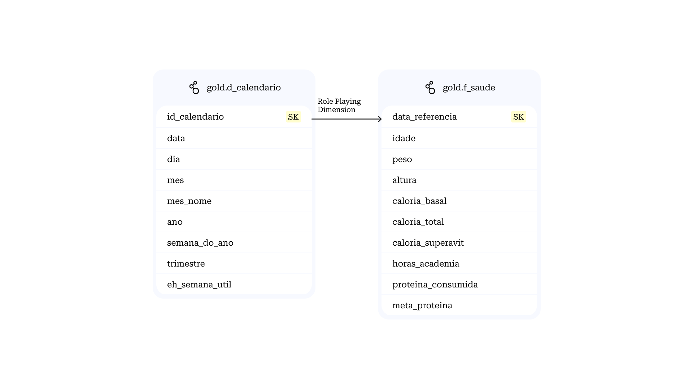

# Paineis

## Página de Dieta

Eu tenho a necessidade de acompanhar minha caloria diária, 
consumo de proteína e esforço físico, para determinar se eu 
estou seguindo minhas metas da melhor forma possível. Eu também 
preciso acompanhar meu peso e gordura corporal.

As metas possíveis são:
- Cutting com defícit de até 300 calorias
- Bulking com superávit de até 300 calorias

Perguntas que devo responder:
- Eu estou me exercitando o suficiente?
- Eu estou consumindo proteína o suficiente?
- Minha caloria está no patamar correto?
- Eu estou ganhando/preservando músculo?

E, finalmente, acompanhar esses dados via 
série histórica.

### Modelagem

#### Base

gold.d_calendario:
- id_calendario (sk YYYYMMDD)
- data
- dia
- mes
- mes_nome
- ano
- semana_do_ano
- trimestre
- eh_semana_util

#### Alimentação

silver.dlq_alimento:
- id_alimento (sk)
- nome_alimento 
- unidade_observada
- motivo
- data_criacao

gold.d_alimento:
- id_alimento (sk)
- nome_alimento 
- categoria_alimento [LAD]
- unidade_de_medida (grama|hora|unidade|etc...)
- quantidade_referencia (50|100|etc...)
- imprecisão ("Baixo", "Médio", "Alto") [LAD]
- proteina [LAD]
- gordura [LAD]
- carboidrato [LAD]
- caloria [LAD]

gold.f_dieta_diaria:
- data_referencia (d_calendario sk)
- id_alimento (d_alimento sk)
- quantidade 
- proteina
- gordura
- carboidrato
- caloria

#### Saúde

gold.f_saude:
- data_referencia (d_calendario sk)
- idade 
- peso 
- caloria_basal 
- caloria_total
- caloria_consumido
- proteina_consumida
- meta_caloria_deficit
- meta_caloria_superavit
- meta_proteina

### ETL

0. Ter a d_calendario feita
1. Ingerir dados de dieta para o GCS (bronze.notas_nutricao)
2. Fazer processamento NLP para estruturar dados de dietas (bronze.notas_nutricao_enriquecida)
3. Encontrar forma canônica (alimento-unidade) para cada alimento e criar com RAG a d_alimento
4. Inserir formas alternativas em uma tabela DLQ
5. Construir tabela f_dieta_diaria
